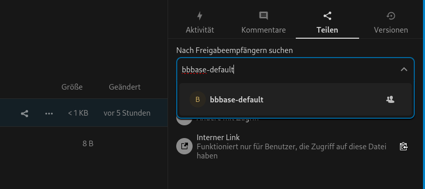

# BBBase Media

!!! info
    BBBase basiert auf Nextcloud. Grundlegende Informationen zu diesem Werkzeug findet ihr [hier](https://docs.nextcloud.com/server/20/user_manual/de/)

## Grundlegende Verwendung

BBBase Media dient dem Teilen von Medien wie Audiobooks oder Ebooks, die ihr anderen zur Verfügung stellen wollt. Ihr könnt aber auch auf die Medien zugreifen, die andere zur Verfügung gestellt haben.

!!! warning "Wichtig"
    BBBase Media dient nicht dem Teilen von textbasierten Dokumenten wie PDFs oder Word-Dokumenten. Dafür ist [BBBase Wissensaustausch](BBBase%20Wissensaustausch.md) gedacht.

### Teilen von Medien

Wenn ihr etwas auf BBBase Media hochlädt, seht standartmässig nur ihr das. Ihr könnt aber auch anderen den Zugriff darauf geben. Dazu müsst ihr die Datei auswählen und dann auf "Teilen" klicken. Dort könnt ihr dann die E-Mail-Adresse der Person eingeben, mit der ihr die Datei teilen wollt.

Ihr könnt aber auch eure Medien mit allen teilen. Dazu könnt ihr die Datei mit der Gruppe "bbbase-default" teilen. Diese Gruppe beinhaltet alle Benutzer von BBBase.

